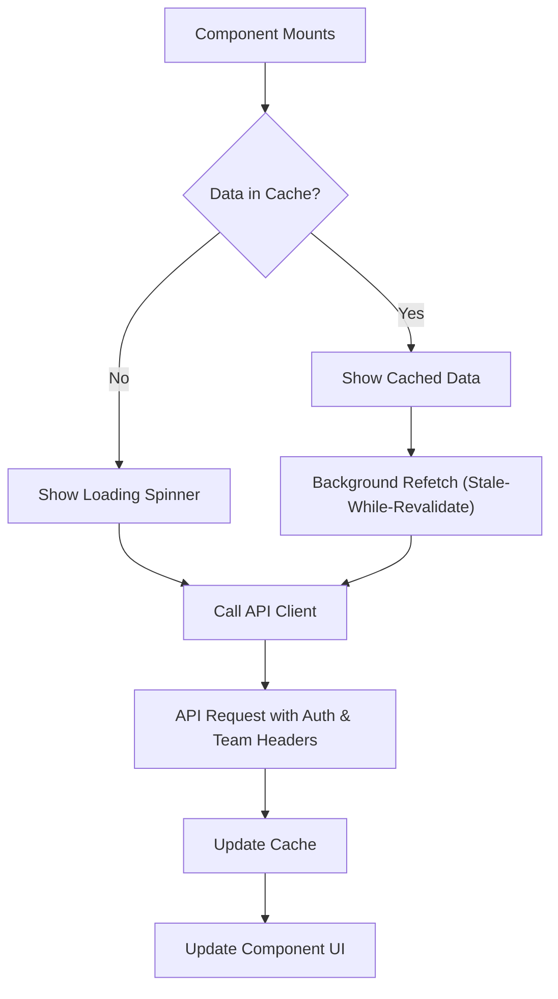

# Flamingo Project Knowledge Transfer (KT) Document

## 1. Project Overview
**Flamingo** is the frontend application for the DViO One platform (version 2). It is a modern Single Page Application (SPA) built to deliver a robust dashboard and management interface for marketing and team collaboration.

### Key Features
- **Dashboarding:** Comprehensive analytics for Paid Social, Paid Search, Organic Social, and more.
- **Team Management:** User roles, team switching, generic team creation/management.
- **Connectors:** Integrations with Google Ads, Meta Ads, LinkedIn, HubSpot, etc.
- **Chat:** Real-time conversation capabilities.
- **Authentication:** Secure login, registration, and password management flow.

## 2. Technology Stack
The project leverages a modern React ecosystem:

| Category | Technology | Version | Purpose |
|----------|------------|---------|---------|
| **Core** | React | 19.x | UI Library |
| **Build Tool** | Vite | 6.x | Dev server & bundler |
| **Language** | TypeScript | 5.x | Static typing |
| **Styling** | Tailwind CSS | 4.x | Utility-first CSS |
| **UI Components** | Shadcn UI | - | Accessible component primitives |
| **Routing** | React Router | 7.x | Client-side routing |
| **State Management** | Zustand | 5.x | Global state & logic |
| **Data Fetching** | TanStack Query | 5.x | Server state management |
| **Icons** | Lucide React | - | Iconography |
| **Monitoring** | Sentry | 9.x | Error tracking & performance |

## 3. Folder Structure
The codebase is organized in `src/` following a feature-based and functional split:

```
src/
├── assets/          # Static assets (images, fonts)
├── components/      # Shared UI components AND specific feature components
│   └── ui/          # Shadcn UI primitives (Button, Input, etc.)
├── contexts/        # React Context providers (Theme, Date)
├── hooks/           # Custom React hooks
├── layout/          # Layout wrappers (PublicLayout, PrivateLayout)
├── lib/             # Utilities and configuration
│   ├── apiClient.ts    # Centralized Axios/Fetch wrapper
│   ├── queryClient.ts  # React Query configuration
│   └── secureStorage.ts # Wrapper for local storage
├── routes/          # Application pages/screens mapped to routes
│   ├── auth/        # Login, Register, Reset Password pages
│   ├── connector/   # 3rd party integration config pages
│   ├── dashboard/   # Analytics dashboard pages
│   └── team/        # Team management pages
├── stores/          # Zustand global stores
│   ├── useAuthStore.ts       # Auth state (user, token, team)
│   ├── useTeamStore.ts       # Team listing and selection
│   └── useCompetitorStore.ts # Competitor analysis state
├── utils/           # Helper functions
├── App.tsx          # Main routing table and provider setup
├── entry.client.tsx # Application entry point
└── main.css         # Global styles and Tailwind directives
```

## 4. Configuration & Environment

### Environment Variables (.env)
Create a `.env` file based on `.env.example`.

| Variable | Description |
|----------|-------------|
| `VITE_BACKEND_URL` | API server URL (e.g., `http://127.0.0.1:8000`) |
| `VITE_AI_MODEL` | AI Model ID for chat features |
| `VITE_SENTRY_DSN` | Sentry Data Source Name for error logging |
| `VITE_CLARITY_ID` | Microsoft Clarity analytics ID |

### Key Config Files
- **`vite.config.ts`**: Configures Vite plugins (React, Sentry), path aliases, and proxy settings.
- **`package.json`**: Dependency management and scripts.
- **`tsconfig.json`**: TypeScript compiler options.

## 5. Build & Run Instructions

### Prerequisites
- Node.js (Latest LTS recommended)
- pnpm package manager

### Commands
```bash
# Install dependencies
pnpm install

# Start development server (http://localhost:5173)
pnpm dev

# Build for production
pnpm build

# Preview production build
pnpm preview

# Run type checker
pnpm typecheck
```

## 6. Key Architecture & Concepts

### Authentication & Authorization
- **Store:** `useAuthStore` is the source of truth for auth state (`user`, `token`, `activeTeamId`).
- **Persistence:** Tokens are stored using `secureStorage` (wrapper around localStorage).
- **Guards:** `PrivateLayout` checks `useAuthStore.user`. If missing, redirects to `/login`.
- **Team Switching:** Users belong to teams. The token is associated with a user, but `team_id` is sent in headers to context-switch data.

### Routing & Access Logic
The application uses **React Router v7** with a clear separation between public and private routes.

- **Route Structure:**
  - **Public Routes:** `/login`, `/register`, `/forgot-password`. Accessible without a token.
  - **Private Routes:** Wrapped in `<PrivateLayout />`. Includes `/dashboard`, `/team`, `/connector`, `/chat`.
  - **Lazy Loading:** All major routes are lazy-loaded using `React.lazy` and `Suspense` with a global spinner fallback to optimize initial load time.
- **Top-Level Routes:**
  - `/dashboard`: The main analytics view, nested with sub-routes for specific channels.
  - `/team`: Administrative connection and settings management.
  - `/connector`: Configuration pages for adding 3rd party integrations.
  - `/chat`: AI assistant interface.

### Dashboard Architecture & Data Flow
The dashboard uses a **Parent-Controlled Refresh Pattern**.

1.  **Layout:** `DashboardLayout` provides the shell (sidebar, header).
2.  **State:** The parent page (e.g., `Overall.tsx`) manages a `refreshTrigger` state.
3.  **Components:** Individual widgets (e.g., `GoogleAdsSection`) accept `refreshTrigger`.
4.  **Fetching:** When `refreshTrigger` changes or on mount, widgets fetch their specific data via React Query.
5.  **Data Flow:**
    - Parent checks `activeTeam.connections` to determine which sections to render.
    - Child components fetch data independently but are coordinated by the parent's refresh button.

### Connector Integration Flow
Connectors (e.g., Google Ads, Meta) follow a customized OAuth or API key flow, often involving "Airbyte" as the underlying engine.

**Example Flow (Google Ads):**
1.  **Initiate:** Frontend calls `/airbyte/initiate-connection`.
2.  **Redirect:** User is redirected to the provider's OAuth consent screen.
3.  **Callback:** User returns with a `secret_id` (handled via URL params).
4.  **Finalize:** User inputs specific details (like Customer ID). Frontend calls `/airbyte/google-ads` with `secret_id` and `customer_id` to link the account.
5.  **Status:** The `activeTeam` object in `useTeamStore` is refreshed to reflect the new `connection_status` ('complete', 'pending', etc.).

### AI Chat Implementation
The AI module resides in `/chat` and features a conversational interface.

- **Frontend:** `NewConversation.tsx` and `ExistingConversation.tsx`.
- **Data Model:** Messages handle complex types like `tool_calls` (for function calling) and `tool_results`.
- **History:** Chat history is fetched and transformed to match the UI component's expected format `UIMessage`.
- **Interaction:** Users send prompts -> Frontend POSTs to API -> API returns streaming response or tool calls -> UI updates in real-time.

### API Integration
- **Client:** A custom `ApiClient` class (singleton in `lib/apiClient.ts`) wraps `fetch`.
- **Interceptors:**
  - Automatically attaches `Authorization: Bearer <token>` header.
  - Automatically attaches `team_id` header if a team is active.
  - Handles `401 Unauthorized` by clearing auth state and redirecting.

## 7. Flow Diagrams

### Component Data Fetching Pattern
Standard pattern for loading data in components using React Query.


